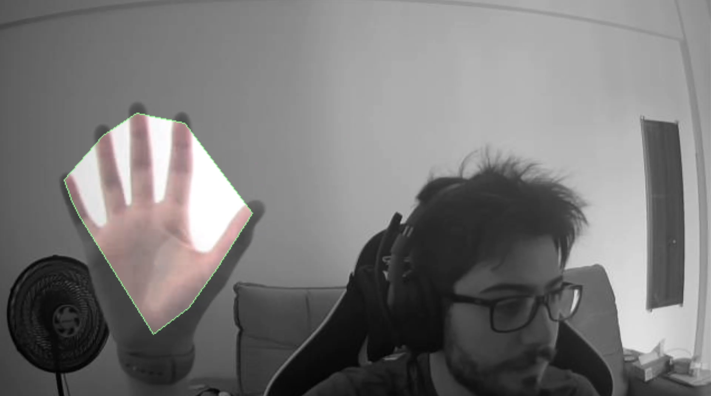

# cameraSegmentation
Projeto 2 para Sensores Inteligentes

>Software para segmentar a imagem de uma webcam entre a mão do usuário e o fundo.

## Pré-requisitos
- Python3
- OpenCV para Python
- Webcam

## Descrição Longa
O projeto do cameraSegmentation visa dividir a imagem feed de uma webcam entre suas mãos e o fundo. O software irá segmentar a imagem, desenhar bounding boxes em volta das mãos e aplicar um filtro no fundo da imagem.
### Ajustes e Melhorias

- [X] Primeira implementação
